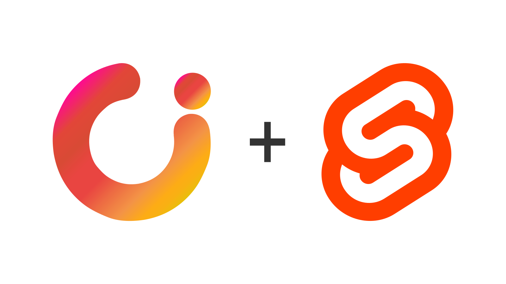

# Sveltekit Components

<div style="text-align:center">
  
</div>
<br>

## Kickstart your development with the Sveltekit Components library, a tool of the **Sveltekit ecosystem** by TheUI. It includes the power of Sveltekit and TailwindCSS to speed up your development. So, build fast, deliver faster.
<br>

The **@theui/sveltekit-components** is an official component library of [**TheUI**](https://www.theui.dev) for **Sveltekit**, designed on the top of TailwindCSS. The components are highly accessible and customizable out of the box.

It includes the power of SvelteKit and the features of the TailwindCSS together to make an awesome tool that speedup your development process.

<br>

## **Features**
 * Accessible components
 * Dark/light mode control
 * Theming and branding just with a single line CSS
 * Highly customizable
 * RTL supports (Coming soon)
 * Fully typed

<br>

## **Components**
* **General Components**
  * Accordion
  * Alert
  * Badge
  * Breadcrumb
  * Button
  * Button group
  * Collapse
  * Container
  * Dark-mode switch
  * Dropdown
  * Modal
  * Navbar
  * Notification
  * Offcanvas
  * Popup (Exit and Entry popup)
  * Progress bar
  * Tabs and pills
  * Table
  * Tooltip
* **Form Components**
  * Form input
  * Check-box
  * Input group
  * Radio button
  * Range
  * Select
  * Textarea
  * Toggle

<br>

---
<br>

## **Installation Guide**
Install the Sveltekit Components library in your project or start a new project with the boilerplate template. Install it anyhow and build fast, deliver faster.

Follow any of the two methods to install the component library.

1. Use the boilerplate from Github.
2. Manually install the component library from scratch.
<br><br>
### **1. Use Boilerplate From Github**

Open your terminal and run the following command to install the boilerplate template. Replce the **project-name** with your desired project name.
<br><br>

```bash
# Clone the project
git clone https://github.com/theui-dev/template-kit.git app-name

# Install node modules
npm i

# Run the application
npm run dev
```
<br>

### **2. Manually Install From Scratch**

To install the component library manually, please follow the steps one by one given below.

#### **2.1&nbsp;&nbsp; Install Svelte/Sveltekit**

```bash
npm create svelte@latest my-app
cd my-app

# Add Tailwind CSS to the application
npx svelte-add@latest tailwindcss

# Install node modules
npm install

# Install TheUI Sveltekit Component 
npm i @theui/sveltekit-components
```
<br>

#### **2.2&nbsp;&nbsp; Add TheUI Components library**

```bash
npm i @theui/sveltekit-components
```

#### **2.3&nbsp;&nbsp; Configuration**
Open TailwindCSS configuration file `tailwind.config.cjs` and update it with the following code.

```js
// 1. Update config.content
// 2. Add config.presets
const config = {
  content: [
    "./src/**/*.{html,js,svelte,ts}",
    "./node_modules/@theui/sveltekit-components/**/*.{html,js,svelte,ts}", // New line
  ],
  presets: [require("@theui/core/preset.cjs")], // New line
  darkMode: 'class',
  theme: {
    extend: {},
  },

  plugins: [],
};

module.exports = config;
```
Open `__layout.svelte` and import the core style file `style.postcss` inside the `<script>` tag. It is required for the custom color classes to work properly.
```html
<script>
  import '../../node_modules/@theui/core/style.postcss' // Add this line inside script tag
  import "../app.css"
</script>
```

And thats all. You are ready to start your awesome project now.

<br>

<br>

# Colors and Branding
Sveltekit has been developed based on the TailwindCSS, a powerful tool that can generate almost any CSS style and unlimited (available) colors for your design. But the question is, do you need unlimited colors for your design?

Well, there is no issue if we have a tool beside us that can generate any color we want. But the problem is the inconsistency of using it. If you have many options, it is very much possible to break the consistency, which will produce randomness in your design.

To solve this issue, the "TheUI Sveltekit" component library has introduced ten custom colors option that merges with other colors provided by TailwindCSS. You can customize your theme in just one line by changing the value of CSS variables of these custom colors only.

## **TheUI Colors & Default Values**
"TheUI Sveltekit" component library has the following CSS variables and values. All the CSS variables are prefixed with ui to avoid conflict with other vars.

```css
@layer base{
  :root {
    /* Brand colors */
    --ui-brand                    : 80 70 230;    /* #5046E6 */
    --ui-brand-active             : 67 56 202;    /* #4338CA */
    --ui-brand-secondary          : 253 230 138;  /* #FDE68A */
    --ui-brand-secondary-active   : 252 211 77;   /* #FCD34D */

    /* Text colors */
    --ui-text-on-brand            : 255 255 255;  /* #FFFFFF */
    --ui-text-on-brand-secondary  : 8 8 24;       /* #080818 */
    --ui-text-default             : 8 8 24;       /* #080818 */

    /* Background colors */
    --ui-bg-primary               : 255 255 255;  /* #FFFFFF */
    --ui-bg-secondary             : 243 244 246;  /* #F3F4F6 */
    --ui-bg-tertiary              : 229 231 235;  /* #E5E7EB */
  }

  /* To change any color for dark mode, change the color below */
  :root.dark {
    /* Text color on dark mode */
    --ui-text-default             : 229 231 235;  /* #E5E7EB */

    /* Background colors on dark mode */
    --ui-bg-primary               : 8 8 24;       /* #080818 */
    --ui-bg-secondary             : 22 22 38;     /* #161626 */
    --ui-bg-tertiary              : 32 32 48;     /* #202030 */
  }
}
```
> Brand colors are available everywhere. Text colors are not available for background and vice versa.

<br>

## **Use of Custom Colors**
You can use custom classes to use the custom colors in your design. Sveltekit Components library includes the following classes:

| CLASS | DESCRIPTION |
| --- | ----------- |
| .[...]-brand | Brand color for the component. For example, use the .bg-brand class to apply brand color on the background, .text-brand for the foreground, etc. |
| .[...]-brand-active | Slightly deeper or lighter version of the brand color. Use it to express any state like active or hover of an element. For example, use the .bg-brand-active class to apply brand color on the background, .text-brand-active for the foreground, etc. |
| .[...]-brand-secondary | Secondary brand color for the components. For example, use .bg-brand-secondary class to apply brand color on the background, .text-brand-secondary for foreground, etc. |
| .[...]-brand-secondary-active | Same as the .[...]-brand-active, but it is for secondary brand color. |
| .text-on-brand | Foreground color for the background color .bg-brand. |
| .text-on-brand-secondary | Foreground color for the background color .bg-brand-secondary. |
| .text-default | Default text/foreground color for the component library. |
| .text-primary | Default/primary background color. |
| .text-secondary | Secondary background color. |
| .text-tertiary | Tertiary background color. |

<br>

## **Color Customization**
Now, let's come to the main part of the doc - how to customize it? As you read above on this page, you can do this just with one line of code. Change the value of the corresponding CSS variable you want, and you are good to go. If you want to change other default colors, change values in the same way.

Let, your brand color is **rgb(255, 0, 0)**. Also, you want to change the default text color to **rgb(0,0,0)**. To change the value of the default color provided by the component library to your preferred one, open the `./src/app.css` or `./src/app.postcss` (the file which contains your TailwindCSS styles) and add the following line:.

```css
--ui-brand : 255 0 0;
--ui-text-default : 0 0 0;
```

Congratulations! All the components using the brand color and the default text color will change to the new color. You don't need to change anything more than that. To change other colors, follow the same process. All the colors will work in the same way.

> Instead of writing the RGB code **rgb(255, 255, 266)**, why should I write the code in this way? Because, this is how TailwindCSS works to apply opacity with any color.

<br>
<br>

# **Contributions**
Please let us know before starting work on any new features or bug. If you're interested in creating a new feature, create a feature request ticket in [Github Issues](https://github.com/theui-dev/sveltekit-components/issues). This allows for open discourse and may help prevent redudant work. This includes but is not limited to: creating new components, adding new utility features, or major alterations to existing work.

<br>
<br>

# **Copyright and license**
Code and documentation copyright 2022 the [M B Parvez](https://www.mbparvez.me), [Gosoft](https://www.gosoft.io) and [TheUI](https://www.theui.dev).

### **Copyright 2022 TheUI**
Permission is hereby granted, free of charge, to any person obtaining a copy of this software and associated documentation files (the "Software"), to deal in the Software without restriction, including without limitation the rights to use, copy, modify, merge, publish, distribute, sublicense, and/or sell copies of the Software, and to permit persons to whom the Software is furnished to do so, subject to the following conditions:

The above copyright notice and this permission notice shall be included in all copies or substantial portions of the Software.

THE SOFTWARE IS PROVIDED "AS IS", WITHOUT WARRANTY OF ANY KIND, EXPRESS OR IMPLIED, INCLUDING BUT NOT LIMITED TO THE WARRANTIES OF MERCHANTABILITY, FITNESS FOR A PARTICULAR PURPOSE AND NONINFRINGEMENT. IN NO EVENT SHALL THE AUTHORS OR COPYRIGHT HOLDERS BE LIABLE FOR ANY CLAIM, DAMAGES OR OTHER LIABILITY, WHETHER IN AN ACTION OF CONTRACT, TORT OR OTHERWISE, ARISING FROM, OUT OF OR IN CONNECTION WITH THE SOFTWARE OR THE USE OR OTHER DEALINGS IN THE SOFTWARE.

<br>

---

<br>

## **Special Thanks To [Gosoft.io](https://www.gosoft.io) and [BIPBY Digital](https://www.bipby.digital) for being our digital partner**